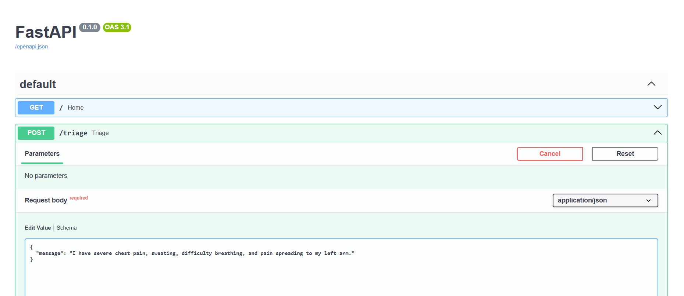
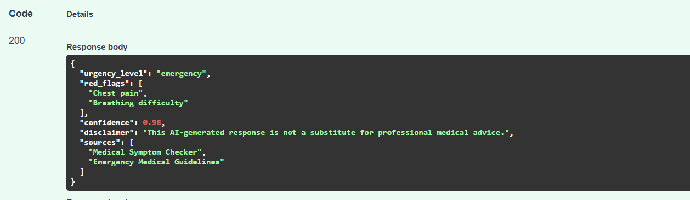

# Symptom Triage Agent

## Overview

The Symptom Triage Agent is an AI-powered healthcare assistant that analyzes user-reported symptoms and provides a preliminary triage assessment. The system identifies potential emergency symptoms, optionally gathers supporting information, and generates a structured triage response using a Large Language Model (LLM).

**Disclaimer:** This application is intended for educational and research purposes only. It is not a substitute for professional medical advice, diagnosis, or treatment.

---

# Architecture

## High-Level Workflow

```text
User Input
     |
     v
FastAPI Endpoint (/triage)
     |
     v
LangGraph Workflow
     |
     +----------------------+
     |                      |
     v                      |
Detect Red Flags            |
     |                      |
     v                      |
Emergency Router ---------->|
     |                      |
     | Emergency            | Non-Emergency
     v                      v
 Final Triage        Search Decision
                            |
                            v
                      Web Search Node
                            |
                            v
                       Final Triage
                            |
                            v
                     Structured Response
```

---

## Workflow Nodes

### 1. Detect Red Flags

This node scans the symptom description for emergency indicators such as:

- Chest pain
- Difficulty breathing
- Stroke symptoms
- Seizures
- Severe bleeding
- Loss of consciousness

Output:

```python
{
    "red_flags": [...],
    "emergency": True/False
}
```

---

### 2. Emergency Router

Determines whether the patient should be routed directly to triage or proceed through additional information gathering.

Output:

```python
"emergency"
```

or

```python
"normal"
```

---

### 3. Search Decision

Determines whether external information retrieval is required.

Emergency cases bypass search.

Output:

```python
{
    "need_search": True
}
```

or

```python
{
    "need_search": False
}
```

---

### 4. Search Node

Uses a web search utility to retrieve relevant medical information.

Responsibilities:

- Gather supporting information
- Improve contextual understanding
- Provide reference sources

Output:

```python
{
    "sources": [...]
}
```

---

### 5. Final Triage

Uses an LLM with structured output to generate:

- Urgency level
- Confidence score
- Red flags
- Sources
- Medical disclaimer

Example:

```json
{
  "urgency_level": "medium",
  "red_flags": [],
  "confidence": 0.87,
  "sources": ["medical knowledge"],
  "disclaimer": "This AI-generated response is not a substitute for professional medical advice."
}
```

---

# Tech Stack

## Backend

- Python 3.12
- FastAPI
- Uvicorn

Purpose:

- REST API development
- Request handling
- API documentation

---

## AI & Agent Framework

### LangGraph

Used for:

- Agent orchestration
- Workflow routing
- State management
- Conditional execution

---

### LangChain

Used for:

- LLM integration
- Structured output handling
- Prompt management

---

### Ollama

Used for local LLM inference.

Benefits:

- Runs completely offline
- No external API costs
- Supports multiple open-source models

Example models:

- Llama 3
- Mistral
- Gemma

---

## Data Validation

### Pydantic

Used for:

- Request validation
- Response schemas
- Structured LLM outputs

---

## Search Layer

### DuckDuckGo Search

Used for:

- Symptom-related information retrieval
- Source collection
- Context enhancement

---

# API

## POST /triage

Request:

```json
{
  "message": "I have fever and headache"
}
```

Response:

```json
{
  "urgency_level": "low",
  "red_flags": [],
  "confidence": 0.85,
  "disclaimer": "This AI-generated response is not a substitute for professional medical advice.",
  "sources": []
}
```

---

# Project Structure

```text
symptom-triage-agent/
│
├── main.py
├── graph.py
├── nodes.py
├── tools.py
├── llm.py
├── run_cases.py
├── triage_results.json
├── README.md
│
└── venv/
```

---

# Future Improvements

- Medical knowledge base integration
- Retrieval-Augmented Generation (RAG)
- Symptom severity scoring
- User authentication
- Conversation memory
- Clinical guideline integration
- Multi-language support
- Frontend dashboard

---

# Running the Project

Create virtual environment:

```bash
python -m venv venv
```

Activate:

```bash
venv\Scripts\activate
```

Install dependencies:

```bash
pip install -r requirements.txt
```

Run FastAPI:

```bash
python -m uvicorn main:api --reload
```

Open:

```text
http://127.0.0.1:8000/docs
```

---

### Screenshots

## Swagger UI: Input

## 

## API Response: Output

## 
